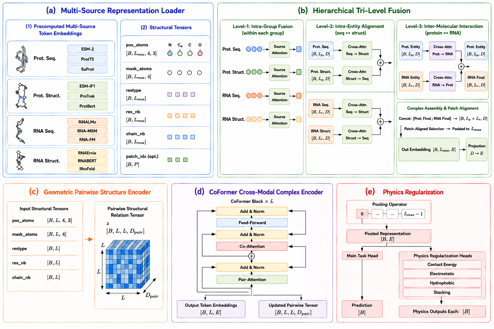
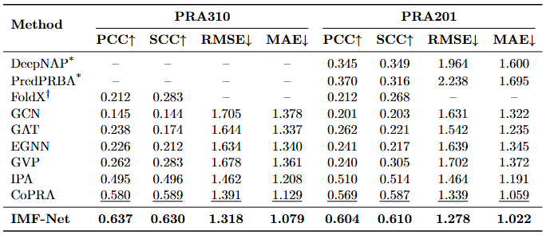

# IMF-Net

This is the official implementation of IMF-Net: Interpretable Multisource Fusion with
Physicochemically Motivated Constraints for Protein–RNA Binding Affinity Prediction 



IMF-Net is a state-of-the-art predictor of protein--RNA binding affinity. The framework of IMF-Net is based on a dual-modality architecture that seamlessly integrates multisource representations from protein sequence, protein structure, RNA sequence, and RNA structure foundation models. In contrast to methods relying on massive unsupervised pre-training, IMF-Net achieves robust generalization directly on the PRA310 and PRA201 benchmark data sets by incorporating a Physics-Informed Auxiliary module to impose strict thermodynamic and geometric constraints. Furthermore, the flexible architecture of IMF-Net holds great potential to be extended for predicting mutation-induced affinity changes in protein--RNA complexes. 

## 🛠️ Installation

```
git clone https://github.com/ENE574/IMF-Net.git
cd IMF-Net
conda env create -f environment.yml
```

## 📖 Datasets, offline embeddings and model weights for Protein-RNA binding affinity prediction

Here, we first provide our proposed datasets, including PRA310, PRA201 dataset, you can easily access them through 🤗Huggingface: [/ENE574/IMF-Net_data](https://huggingface.co/datasets/ENE574/IMF-Net_data/tree/main). The only difference between PRA201 and PRA310 are the selected samples, thus the PRA201 labels and splits are in PRA310/splits/PRA201.csv. Download these datasets and place them at `./datasets` folder.

The number of samples of the original dataset is shown below, we take PRA as the abbreviation of Protein-RNA binding affinity:

| Dataset | Type | Size |
| :---: | :---: | :---: |
| PRA310 | PRA | 310 |
| PRA201 | PRA (pair-only) | 201 |


We also provide five-fold model checkpoints of IMF-Net finetuned on PRA310, and they can also be downloaded through 🤗Huggingface: [/ENE574/IMF-Net](https://huggingface.co/ENE574/IMF-Net). Download these weights at place them at `./weights` folder.

The performance of 5-fold cross validation on PRA310 reaches state-of-the-art, and here is the comparison:




## 🚀 Training on the protein-RNA datasets

### Run 5-fold inference on PRA310
```
python run.py test dG --model_config ./config/models/imf-net.yml --data_config ./config/datasets/PRA310.yml --run_config ./config/runs/test_basic.yml
```

### Run finetune on PRA310
```
python run.py finetune dG --model_config ./config/models/imf-net.yml --data_config ./config/datasets/PRA310.yml --run_config ./config/runs/finetune_struct.yml
```

### Run finetune on PRA201
```
python run.py finetune dG --model_config ./config/models/imf-net.yml --data_config ./config/datasets/PRA201.yml --run_config ./config/runs/finetune_struct.yml
```
